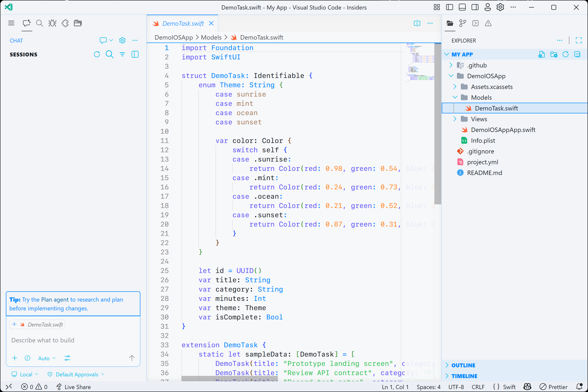
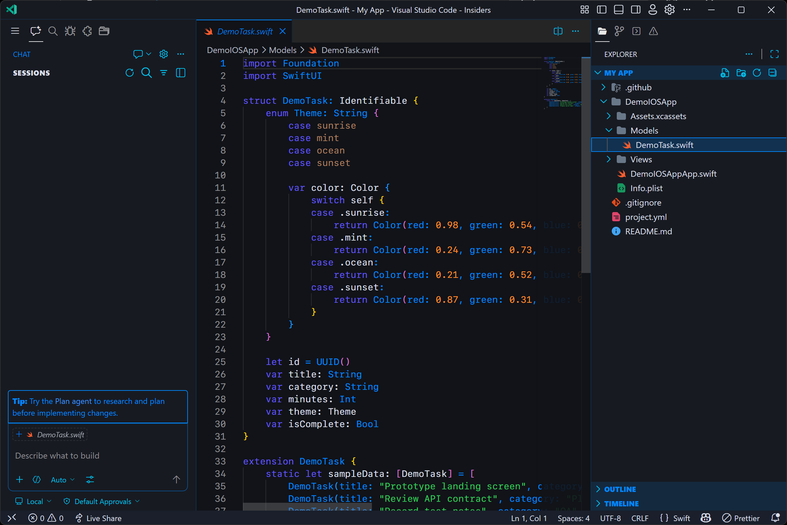

# Cupertino

A SwiftUI-inspired VS Code theme pack using the Cupertino color palette.

## Preview

## Included Themes

- Cupertino Light
- Cupertino Dark

## Language Coverage

Semantic tokens and TextMate scopes are tuned for:

- TypeScript
- JavaScript
- JSON
- Markdown
- Rust
- Python
- Lua
- Swift
- CSS
- HTML
- C++
- C#
- Kotlin
- Java
- Tauri projects via Rust, frontend, JSON, and TOML-oriented scopes

## Palette

- Red: #FF383C
- Orange: #FF8D28
- Yellow: #FFCC00
- Green: #33C758
- Mint: #00C8B3
- Teal: #00C3D0
- Cyan: #00C0E8
- Blue: #0088FF
- Indigo: #6155F5
- Purple: #CB30E0
- Pink: #FF2D55
- Brown: #AC7F5E
- Black: #000000
- Grey: #8F8F94
- White: #FFFFFF

## Run Locally

1. Open this folder in VS Code.
2. Press F5 to launch an Extension Development Host.
3. Open the Command Palette and run `Preferences: Color Theme`.
4. Select `Cupertino Light` or `Cupertino Dark`.

If `Cupertino Dark` does not appear immediately after installing a new VSIX, run `Developer: Reload Window` once and reopen the color theme picker.

## Package

1. Install the packaging tool:
   npm install -D @vscode/vsce
2. Create a VSIX package:
   npx vsce package

## Publish

1. Create a publisher in Visual Studio Marketplace.
2. Login with vsce.
3. Publish with:
   npx vsce publish
